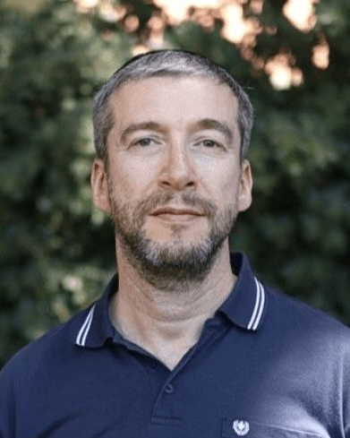
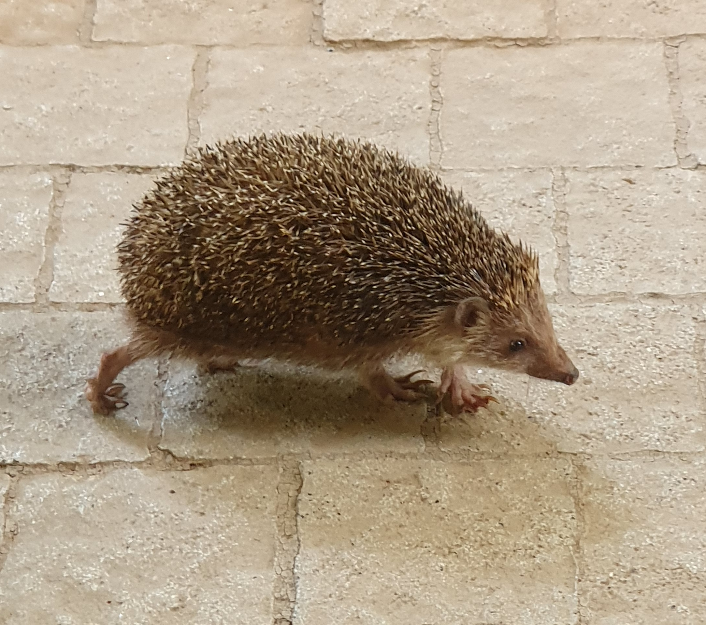

Welcome to my page ;)!

My name is **Anatoly Kustanovich**. 
I work in the [Weizmann Insitute of Science](https://www.weizmann.ac.il/pages/) in the [laboratory of Prof. Schraga Schwartz](https://www.weizmann.ac.il/molgen/schwartz/).
More details You can find on the [Linkedin page](https://www.linkedin.com/in/anatoli-kustanovich/) 

**These are several useful links:**

[Python course in Weizmann Institute](https://github.com/szabgab/wis-python-course-2024-11)

[Page of Gábor Szabó ](https://szabgab.com/)

**And here is a Weizmann's hedgehog :)**

